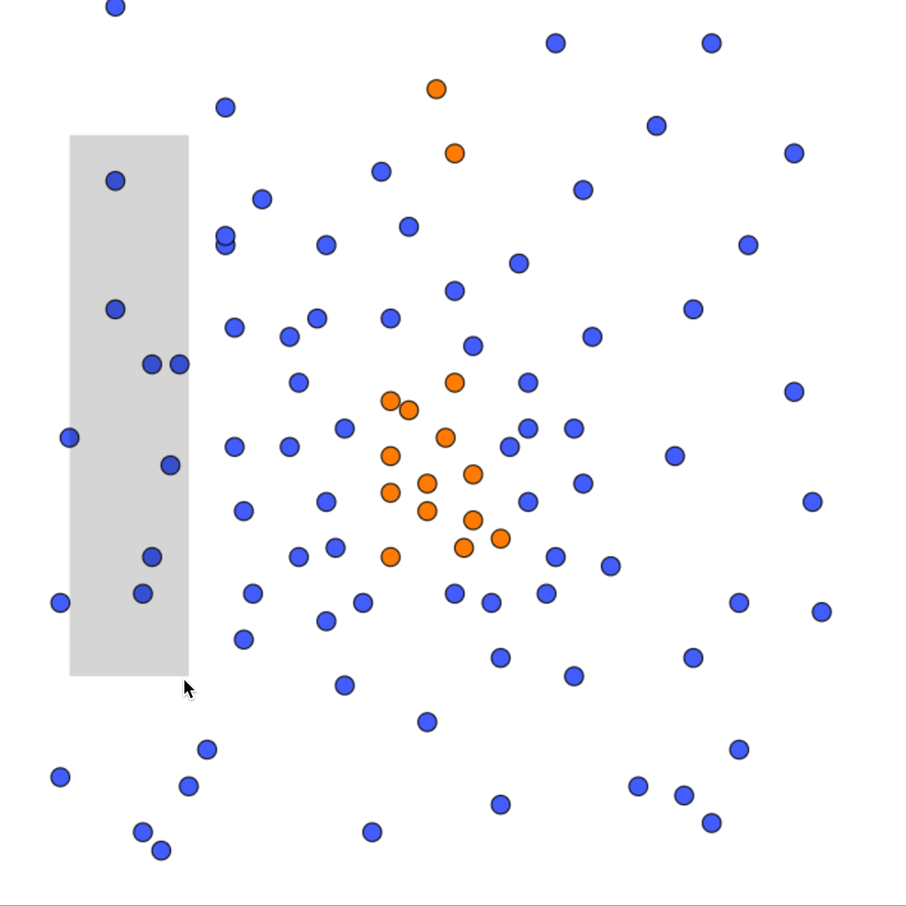

# Quadromud

A MUD1 ECS EntityIndexer built with [Quadrosol](https://github.com/therealbytes/quadrosol.git) to index points in 2D space.



## Running the demo

```bash
git clone https://github.com/therealbytes/quadromud.git
yarn install
yarn dev
```

## Concrete app-chain 

The [Concrete](https://github.com/therealbytes/concrete-geth.git) [Quadrosol app-chain](https://github.com/therealbytes/quadrosol/tree/concrete) has support for quadtrees built into the chain itself. The `concrete` branch of this repo uses an alternative version of quadrosol that takes advantage of it.

To run the demo, you will need to run the app-chain locally on the OP Stack.

```bash
git checkout concrete
git submodule update --remote optimism
yarn concrete:devnet:up     # to start
yarn concrete:devnet:down   # to stop and clean
yarn dev                    # to run the demo
```

Alternatively, you can run a regular Optimism Bedrock devnet with these changes:
- Checkout `cb19e2f9cf226a7ff429ffe7ca92148f3d1689f1` in the [Optimism monorepo](https://github.com/ethereum-optimism/optimism)
- Replace the op-geth docker image in `Dockerfile.l2` with `ghcr.io/therealbytes/concrete-quad:v0.0.1`
- Expose port `9546:8546` for WebSocket RPC

See [this diff](https://github.com/therealbytes/optimism/compare/develop...therealbytes:optimism:concrete-quad) for an example.
